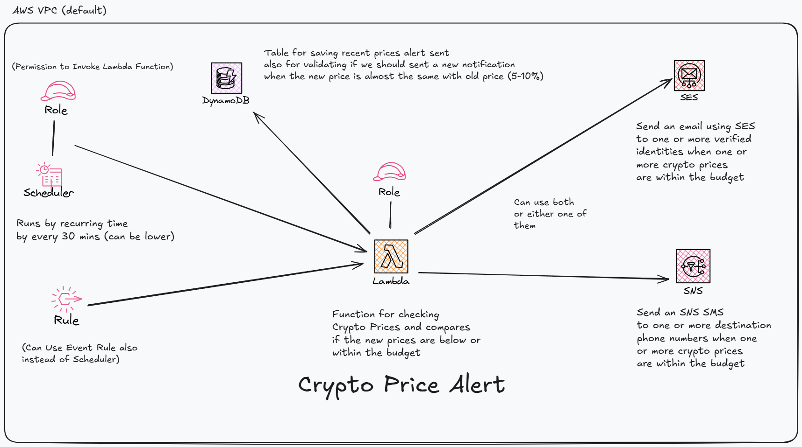

# Crypto Price Watcher
an application that alerts specific emails or phone numbers when a list of cryptocurrencies price dips (going down) or pumping (going up) based on a threshold (__percentage__ or __price value (USD)__)

